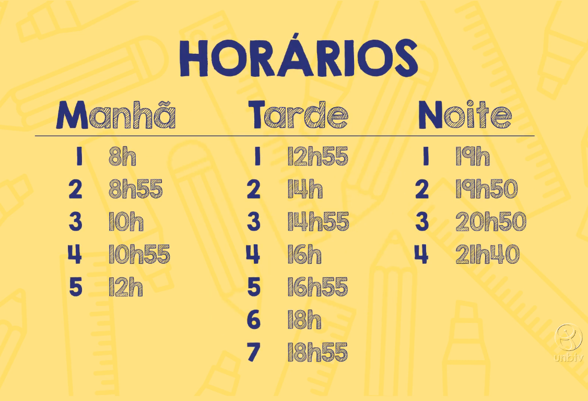
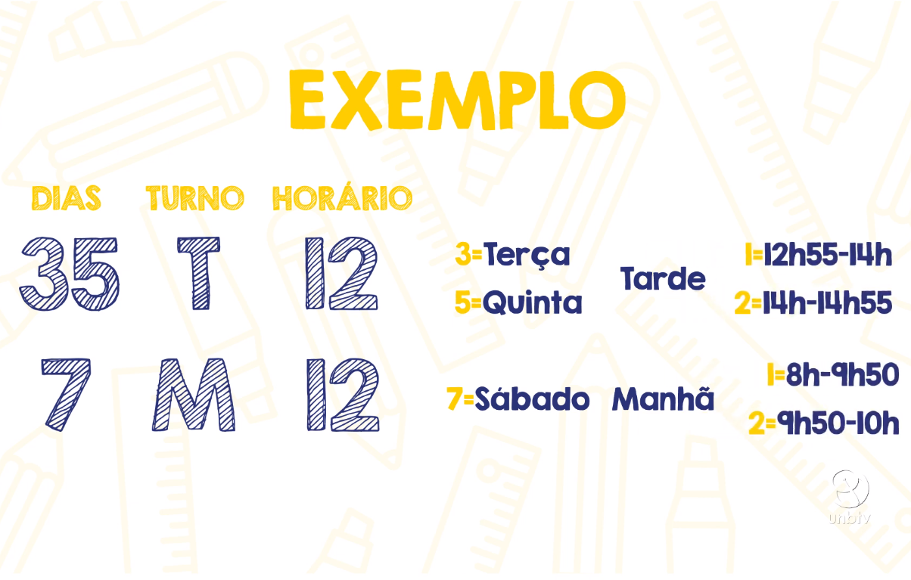
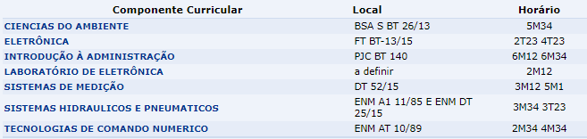
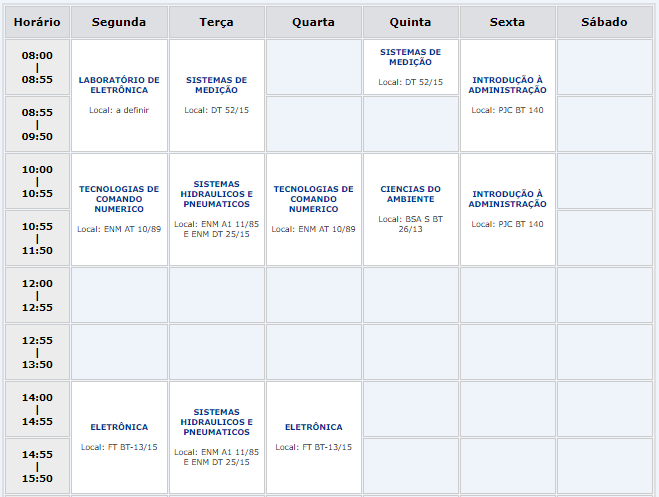
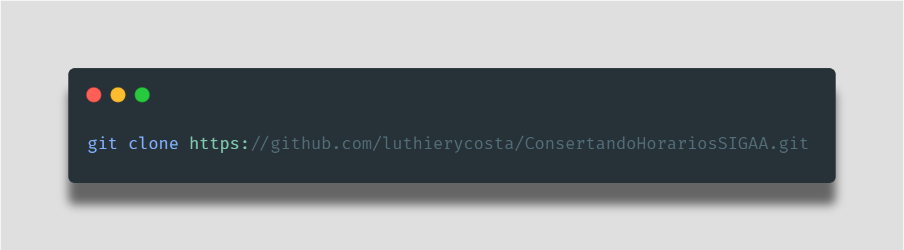
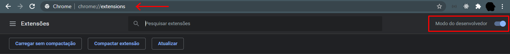

    

<h1 align="center">
  <a href="https://github.com/luthierycosta/ConsertandoHorariosSIGAA">
    Consertando os Horários do SIGAA UnB 
  </a>
</h1>

    Tenha os códigos de horários traduzidos e visualize suas aulas de forma simples e descomplicada com uma grade horária

# Sobre

Em maio de 2020, com as aulas suspensas, a UnB introduziu um sistema diferente de gestão a seus alunos e professores: o [SIGAA](https://sig.unb.br/sigaa/), a exemplo de várias outras universidades pelo país. Uma funcionalidade nova que vem causando incômodo é o formato em que são informadas os horários das aulas. Ao invés de mostrarem horas e dias por extenso como era antes no MatriculaWeb, elas foram codificadas de um jeito difícil de entender à primeira vista.

    
    
    

    
    
    

Certamente há motivos técnicos para se adotar uma representação assim. No entanto, apresentar na tela dessa forma causa estranheza e, mesmo que você não demore tanto para se acostumar, ou decorar o tutorial acima, ainda vai gastar algum tempo fazendo as contas na cabeça quando se der de frente com esse código, especialmente quando as aulas retornarem ou no período de matrículas.

# Sobre a extensão

Trata-se de um script que roda no seu navegador web, procurando esse formato de horário específico do SIGAA por toda a página e trocando-os para dias e horas escritos por extenso. Além disso, cria uma grade horária na página inicial. Ele não faz nenhum tipo de acesso aos servidores internos da UnB, trabalha apenas com o que já foi carregado na página.

## Antes:

## Depois:

    
    

# Instalação

A extensão não está nas lojas oficiais dos navegadores, por ser um simples script de propósito bem específico. Para rodá-la no seu navegador, portanto, é necessário uma extensão gerenciadora de scripts, o Tampermonkey, que permite que scripts de terceiros sejam rodados em determinadas páginas.

  1. Instale a extensão Tampermonkey [por este link](https://www.tampermonkey.net/), escolhendo o navegador e baixando a opção da esquerda (geralmente a mais estável). O botão te redireciona para a loja oficial do navegador. ***Obs**: Não está disponível para Chrome no celular já que ele não permite extensões*.
  2. Com a extensão instalada, clique [aqui](https://github.com/luthierycosta/ConsertandoHorariosSIGAA/raw/master/codigo.user.js) para baixar o código no Tampermonkey. Lá você pode ver uma explicação breve assim como checar o script inteiro antes de instalar. Clique em `Instalar` e pronto!

A extensão aparecerá junto com as outras que você usa no canto da tela. Abrindo a janelinha do Tampermonkey você encontra, por ex., o **Painel de Opções** que te mostra todos os scripts instalados (é pra ter o meu lá) e o botão de **atualizar scripts** que vai pegar o código direto desse repositório, caso eu o modifique ao longo do tempo.

  

Ali mostra que nenhum script está sendo executado. Quando você entrar no SIGAA, ele começa a rodar. Vai aparecer desse jeito e você pode desativar e reativar quando quiser.

  

# Quer colaborar com o projeto?

Sinta-se à vontade para adicionar mais funcionalidades, melhorar o algoritmo ou torná-lo mais elegante, afinal o projeto tem como finalidade levar mais facilidade à comunidade da UnB, e todos que pertencem a ela são bem vindos. Quer colaborar com o projeto mas não sabe debugar uma extensão de navegador? É simples, aqui usaremos o Google Chrome para debug, já que os arquivos estão organizados como extensão do Chrome. Primeiro é necessário clonar o repositório para alguma pasta de sua máquina:

  

Feito isto, entre no Google Chrome e digite o seguinte na barra de pesquisa: _chrome://extensions/_. Certifique-se de que o modo desenvolvedor esteja habilitado. Clique em "Carregar sem compactação" e escolha a pasta do projeto. Pronto! Toda alteração que você fizer no código refletirá na extensão.

  

***
### Encontrou bugs ou alguma página onde ele não ativa?
Me avisa pelo [Twitter](https://twitter.com/luthierycosta) ou aqui mesmo no Github, na aba "Issues" ali em cima.
***
O ideal é que o sistema mostre essa informação intuitivamente sem precisar de uma gambiarra de um terceiro. Enquanto esse dia não chega, temos essa alternativa. Obrigado por baixar galera! Usem e divulguem com os amigos unbersitários. Enois :heart: :cowboy_hat_face:
